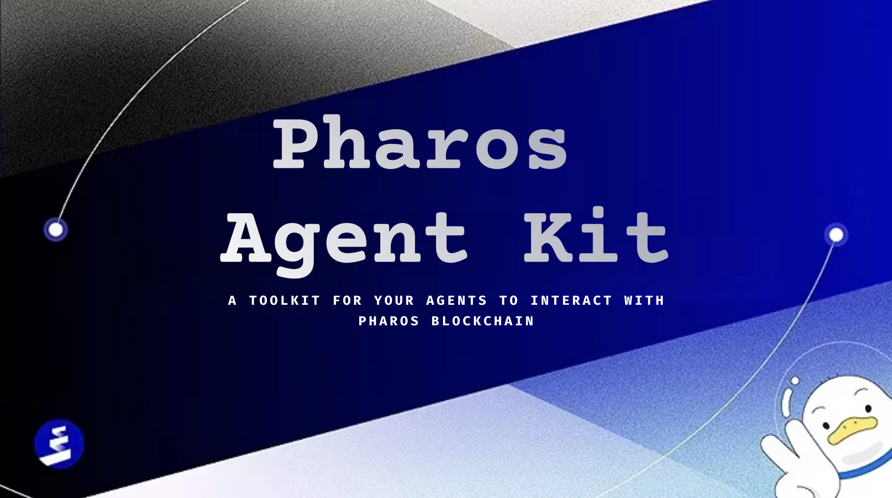

<div align="center">

# 🌟 Pharos Agent Kit



---

### 🤖 Empowering AI Agents with Blockchain Capabilities 🔗

</div>


> 🚀 An open-source toolkit for connecting AI agents to Pharos protocols. Now, any agent, using any model can autonomously perform various Pharos actions:


### ✨ Key Features

- 💰 Check ETH balance
- 🔄 Check ERC20 token balances
- 💸 Transfer ETH or ERC20 tokens
- 📊 Get token pricing data
- 📈 Fetch trending tokens
- 📉 Monitor market movements
- 🏦 Access DeFi protocols
- 🎯 And more...


---

> 🌐 Anyone - whether an SF-based AI researcher or a crypto-native builder - can bring their AI agents trained with any model and seamlessly integrate with Pharos blockchain.


## 🔧 Core Blockchain Features

### 💎 Token Operations

- 💳 Check ERC20 token balances
- 💱 Transfer ERC20 tokens


### 📊 Market Data Integration

- 🦎 CoinGecko Pro API integration
- ⚡ Real-time token price data
- 📈 Trending tokens and pools
- 🚀 Top gainers analysis
- 🔍 Token information lookup


### 🏦 DeFi Data Access

- 📊 Protocol TVL tracking with DeFiLlama
- 💹 Price feeds and aggregation
- 📉 Token trading data


### 🌐 Social Data

- 🤖 Elfa AI social media insights
- 📊 Trending tokens by social activity
- 📱 Smart mentions tracking
- 👥 Social account analysis


## 🤖 AI Integration Features

### 🔗 LangChain Integration

- 🛠️ Ready-to-use LangChain tools for blockchain operations
- 🎯 DynamicStructuredTool-based implementation
- ✅ Zod schema validation
- 🛡️ Comprehensive error handling


### 🚀 Vercel AI SDK Integration

- 🔌 Vercel AI SDK for AI agent integration
- 🌐 Framework agnostic support
- ⚡ Quick and easy toolkit setup


### 📡 MCP Integration

- 🤝 Support for the Model Context Protocol
- 🏗️ Action-based architecture
- 📝 Structured schema definitions


### 🎨 AI Tools

- 🎨 DALL-E integration for image generation
- 🗣️ Natural language processing for blockchain commands
- 📊 Price feed integration for market analysis


## 📦 Installation

```bash
npm install pharos-agent-kit
```

## 🚀 Quick Start

```typescript
import { PharosAgentKit, createPharosTools } from "pharos-agent-kit";

// Initialize with private key and optional RPC URL
const agent = new PharosAgentKit(
  "your-wallet-private-key",
  "https://rpc-url.example.com",
  { OPENAI_API_KEY: "your-openai-api-key" } // optional config
);

// Create LangChain tools
const tools = createPharosTools(agent);
```

## 📚 Usage Examples

### 💰 Check ERC20 Token Balance

```typescript
const balance = await agent.getBalance("0x1234567890123456789012345678901234567890");
console.log("Token Balance:", balance);
```

### 💸 Transfer ERC20 Tokens

```typescript
const txHash = await agent.transfer(
  "0x1234567890123456789012345678901234567890", // to address
  1.5, // amount
  "0xabcdef1234567890abcdef1234567890abcdef12" // token address (optional for native token)
);
console.log("Transfer Transaction:", txHash);
```


### 📊 Get Token Price Data from CoinGecko

```typescript
const priceData = await agent.getTokenPriceDataUsingCoingecko(
  "0x1234567890123456789012345678901234567890", // Token address
  "0xabcdef1234567890abcdef1234567890abcdef12" // Another token address
);
console.log("Token prices:", priceData);
```

### 📈 Get Trending Tokens

```typescript
const trendingTokens = await agent.getTrendingTokens();
console.log("Trending tokens:", trendingTokens);
```

### 📊 Get Protocol TVL from DeFiLlama

```typescript
const tvl = await agent.fetchProtocolTvl("uniswap");
console.log("Uniswap TVL:", tvl);
```

### 🛠️ Creating a New Tool

Here's a complete example of creating a new tool in Pharos Agent Kit:

#### 1️⃣ Create the Tool

**`src/tools/my_tool/my_function.ts`**:
```typescript
import { PharosAgentKit } from "../../agent";
import { Address } from "viem";

/**
 * Description of what your tool does
 * @param agent - PharosAgentKit instance
 * @param param1 - Description of first parameter
 * @param param2 - Description of second parameter
 * @returns Promise resolving to the result
 */
export async function my_function(
  agent: PharosAgentKit,
  param1: string,
  param2?: Address,
): Promise<any> {
  // Implementation of your tool
  // Use agent.connection, agent.wallet, etc. to interact with blockchain
  
  return result;
}
```

**`src/tools/my_tool/index.ts`**:
```typescript
export * from "./my_function";
```

#### 2️⃣ Create a LangChain Tool

**`src/langchain/my_tool/my_tool.ts`**:
```typescript
import { Tool } from "langchain/tools";
import { PharosAgentKit } from "../../agent";

export class MyTool extends Tool {
  name = "my_tool_name";
  description = `Description of what your tool does.
  
  Inputs (JSON string):
    - param1: string, description (required)
    - param2: string, description (optional)`;

  constructor(private agent: PharosAgentKit) {
    super();
  }

  protected async _call(input: string): Promise<string> {
    try {
      const parsedInput = JSON.parse(input);
      const { param1, param2 } = parsedInput;
      
      if (!param1) {
        throw new Error("param1 is required.");
      }
      
      const result = await this.agent.myFunction(param1, param2);
      
      return JSON.stringify({ status: "success", data: result });
    } catch (error: any) {
      return JSON.stringify({
        status: "error",
        message: error.message,
      });
    }
  }
}
```

#### 3️⃣ Create an Action

**`src/actions/my_tool/my_action.ts`**:
```typescript
import { Action } from "../../types/action";
import { PharosAgentKit } from "../../agent";
import { z } from "zod";

export const myAction: Action = {
  name: "MY_ACTION",
  similes: ["my action", "perform my action", "do my action"],
  description: "Description of what your action does.",
  examples: [
    [
      {
        input: { param1: "value1", param2: "value2" },
        output: { 
          status: "success", 
          data: { result: "example result" },
          message: "Action completed successfully" 
        },
        explanation: "Explanation of what this example demonstrates.",
      },
    ],
  ],
  schema: z.object({
    param1: z.string().describe("Description of param1"),
    param2: z.string().optional().describe("Description of param2"),
  }),
  handler: async (agent: PharosAgentKit, input: Record<string, any>) => {
    const { param1, param2 } = input;
    
    const result = await agent.myFunction(param1, param2);
    
    return {
      status: "success",
      data: result,
      message: "Action completed successfully",
    };
  },
};
```

#### 4️⃣ Add to Agent

**`src/agent/index.ts`**:
```typescript
import { my_function } from "../tools";

export class PharosAgentKit {
  // Existing properties and methods...
  
  async myFunction(param1: string, param2?: Address): Promise<any> {
    return my_function(this, param1, param2);
  }
}
```
---
## ⭐ Acknowledgments

🌟 Special thanks to the Solana Agent Kit team for their pioneering work in blockchain agent development. Their innovative approach has been a significant source of inspiration for this project. While we've developed our own unique implementation for the Pharos ecosystem, their groundbreaking work helped shape our vision.

## 🙏 Credits

We extend our heartfelt gratitude to:

- 👥 Our amazing community of contributors
- 🔧 Open-source maintainers of our dependencies
- 🚀 Early adopters and testers
- 💡 Everyone who provided valuable feedback and suggestions

Your support and contributions have been instrumental in making this project better.

---

## 📚 Dependencies

The toolkit relies on several key libraries:

- 🔧 viem for blockchain interactions
- 🤖 @langchain/core for AI agent tools
- ✅ zod for schema validation
- 🦎 CoinGecko API for market data

## 👥 Contributing

🤝 Contributions are welcome! Please feel free to submit a Pull Request.
Refer to [CONTRIBUTING.md](CONTRIBUTING.md) for detailed guidelines on how to contribute to this project.

## 📄 License

Apache-2 License

## 🔒 Security

🛡️ This toolkit handles private keys and transactions. Always ensure you're using it in a secure environment and never share your private keys.